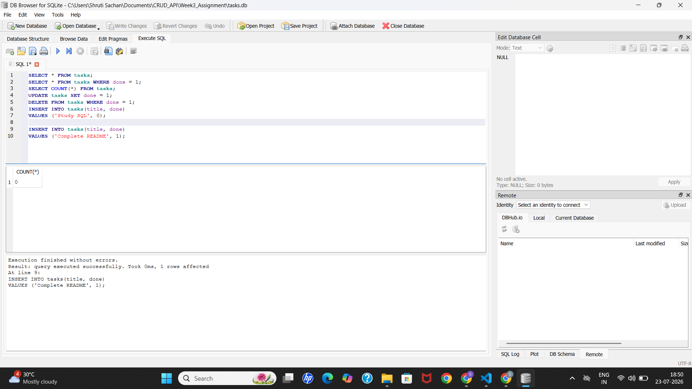
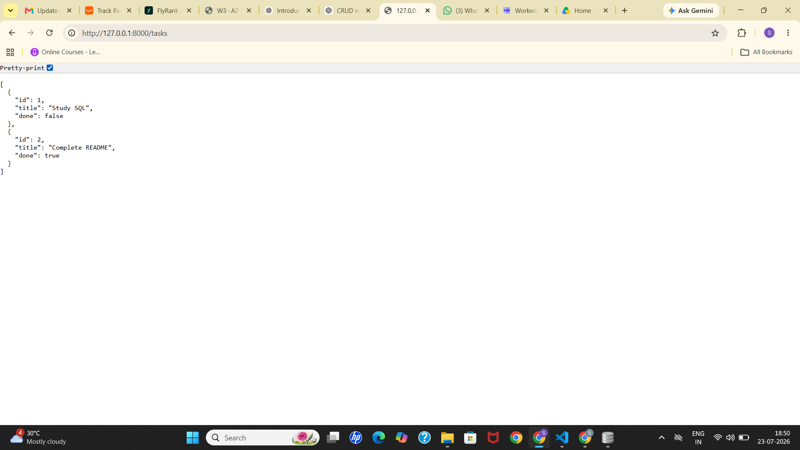

# Task API using FastAPI and SQLite

A simple RESTful Task Management API built using **FastAPI** and **SQLite**. This project demonstrates the implementation of CRUD (Create, Read, Update, Delete) operations with persistent data storage using SQLite. The application automatically creates the database and required table on the first run while providing interactive API documentation with Swagger UI.

## Features

- FastAPI-based REST API
- CRUD operations for tasks
- Persistent data storage using SQLite
- Automatic database and table creation
- Three sample tasks inserted only on the first run
- Automatic Swagger/OpenAPI documentation
- Request validation using Pydantic
- Proper HTTP status codes
- Health check endpoint

## Tech Stack

- **Python 3**
- **FastAPI**
- **SQLite (sqlite3)**
- **Uvicorn**
- **Pydantic**

## Database

This project uses **SQLite** as its database.

### Why SQLite?

SQLite is a lightweight, serverless database that stores all data in a single file (`tasks.db`). It requires no separate installation or database server, making it ideal for learning backend development and small applications.

### Database File

The database file is automatically created in the project directory as:

```text
tasks.db
```

On application startup, the API automatically:

- Creates the database if it does not exist.
- Creates the `tasks` table if it does not exist.
- Inserts three sample tasks only if the table is empty.

## Project Structure

```text
CRUD_API/
│── main.py
│── tasks.db
│── README.md
│── requirements.txt
```
## Installation

### 1. Clone the repository

```bash
git clone https://github.com/shrutisachan08/CRUD_API.git
```

### 2. Navigate to the project

```bash
cd CRUD_API
```

### 3. Create a virtual environment (Recommended)

**Windows**

```bash
python -m venv venv
venv\Scripts\activate
```

**Linux / macOS**

```bash
python3 -m venv venv
source venv/bin/activate
```

### 4. Install dependencies

```bash
pip install -r requirements.txt
```
## Running the API

Start the development server:

```bash
uvicorn main:app --reload
```

The API will be available at:

```
http://127.0.0.1:8000
```
## API Documentation

### Swagger UI

```
http://127.0.0.1:8000/docs
```

### ReDoc

```
http://127.0.0.1:8000/redoc
```
# API Endpoints

| Method | Endpoint | Description | Success Status |
|----------|-----------------|--------------------------|---------------|
| GET | `/` | API information | 200 OK |
| GET | `/health` | Health check | 200 OK |
| GET | `/tasks` | Get all tasks | 200 OK |
| GET | `/tasks/{task_id}` | Get task by ID | 200 OK |
| POST | `/tasks` | Create a new task | 201 Created |
| PUT | `/tasks/{task_id}` | Update an existing task | 200 OK |
| DELETE | `/tasks/{task_id}` | Delete a task | 204 No Content |

# Sample Request

### Create Task

**POST** `/tasks`

```json
{
    "title": "Learn SQLite",
    "done": false
}
```
### Response

```json
{
    "id": 4,
    "title": "Learn SQLite",
    "done": false
}
```
# Example CURL Commands

### Get all tasks

```bash
curl -i http://127.0.0.1:8000/tasks
```

### Get task by ID

```bash
curl -i http://127.0.0.1:8000/tasks/1
```

### Create a task

```bash
curl -i -X POST http://127.0.0.1:8000/tasks ^
-H "Content-Type: application/json" ^
-d "{\"title\":\"Learn SQLite\",\"done\":false}"
```

### Update a task

```bash
curl -i -X PUT http://127.0.0.1:8000/tasks/1 ^
-H "Content-Type: application/json" ^
-d "{\"title\":\"Learn Backend\",\"done\":true}"
```

### Delete a task

```bash
curl -i -X DELETE http://127.0.0.1:8000/tasks/1
```
# Example SQL Queries

### List all tasks

```sql
SELECT * FROM tasks;
```

### Show completed tasks

```sql
SELECT * FROM tasks WHERE done = 1;
```

### Count all tasks

```sql
SELECT COUNT(*) FROM tasks;
```

### Mark every task as completed

```sql
UPDATE tasks SET done = 1;
```

### Delete completed tasks

```sql
DELETE FROM tasks WHERE done = 1;
```
# Swagger UI
# Swagger UI

After running the application, open:

http://127.0.0.1:8000/docs


# Database Screenshot
# Database Screenshot

The SQLite database was inspected using **DB Browser for SQLite**.


# HTTP Status Codes Used

| Status Code | Meaning |
|--------------|---------|
| 200 | Request successful |
| 201 | Resource created successfully |
| 204 | Resource deleted successfully (No Content) |
| 400 | Bad Request |
| 404 | Task not found |

# Future Improvements

- PostgreSQL integration
- User authentication
- Pagination and filtering
- Unit testing with Pytest
- Docker support
- Deployment on Render/Railway
# AI vs Me

## Full AI Prompt

```text
Build a FastAPI Task API using SQLite for persistent storage. The API should support CRUD operations, automatically create the database and tasks table if they do not exist, insert sample tasks only on the first run, use SQL queries for all CRUD operations, validate requests using Pydantic, return appropriate HTTP status codes, and provide Swagger documentation.
```

## Comparison

### 1. What did the AI do better?

- Generated the SQLite integration quickly.
- Produced SQL queries for CRUD operations with minimal setup.
- Suggested a clean structure for connecting FastAPI with SQLite.

### 2. What did the AI get wrong or quietly ignore?

- It did not initially ensure that sample tasks were inserted only once.
- It required manual adjustments to preserve the exact API behaviour from Assignment 1.
- Some SQL queries and response formats needed modification to match the assignment requirements.

### 3. What did my prompt forget to specify?

While reviewing the AI-generated solution, I realized my prompt did not explicitly mention:

- The database should be automatically created.
- The `tasks` table should be created only if it does not exist.
- Sample tasks should be inserted only when the table is empty.
- The API responses should remain identical to Assignment 1.
- The exact SQL queries to use for CRUD operations.

Because these details were missing, the AI made its own implementation decisions.

## Improved Prompt

```text
Build a FastAPI Task API using SQLite.

Requirements:
- Automatically create the SQLite database if missing.
- Automatically create the tasks table if missing.
- Insert three sample tasks only when the table is empty.
- Implement GET, POST, PUT and DELETE using SQL queries.
- Keep the API endpoints and responses identical to the previous assignment.
- Use Pydantic for request validation.
- Return appropriate HTTP status codes.
- Add Swagger summaries and descriptions for every endpoint.
```
## One Rematch – What Changed?

After improving the prompt, the generated solution better matched the assignment requirements. It correctly handled automatic database creation, CRUD operations using SQL, and preserved the API interface while replacing the in-memory list with persistent SQLite storage.

## Reflection

This assignment demonstrated that only the storage layer changed while the API remained the same. Replacing the in-memory list with SQLite made the application persistent without changing the endpoints. Comparing my implementation with AI-generated code also highlighted the importance of writing detailed prompts and understanding the code rather than accepting generated solutions without verification.

# Author

**Shruti Sachan**

B.Tech Electronics & Communication Engineering  
IIITDM Jabalpur

GitHub: https://github.com/shrutisachan08

---

## License

This project is developed for educational purposes as part of a FastAPI backend assignment.